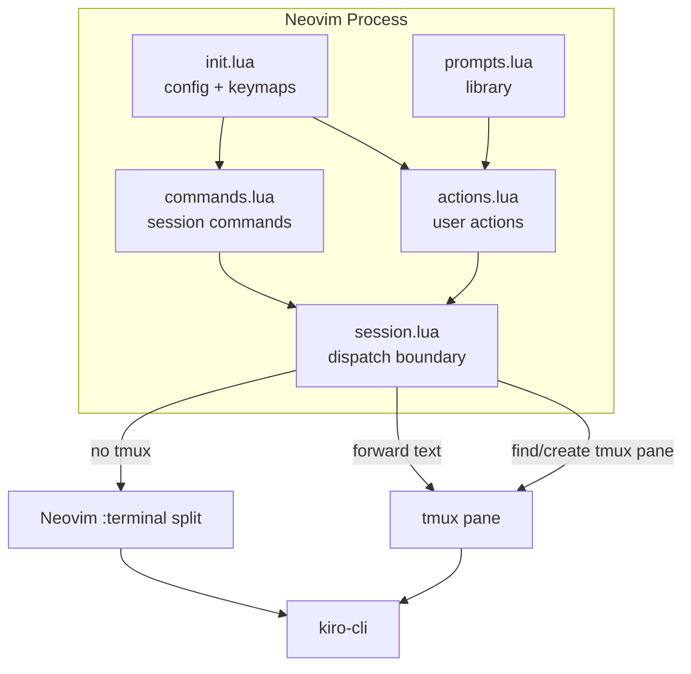

# kiro.nvim — Neovim Plugin for AI Coding Agent

A **Neovim plugin** that integrates the [kiro AI coding agent](https://github.com/yanralapdy/kiro-cli) directly into your editor. Send editor context, code selections, and prompts from inside Neovim — kiro runs in a tmux pane or a Neovim terminal split.

> **Keywords:** neovim plugin, lua, coding agent, ai assistant, developer tools, productivity, tmux integration, code analysis, code review

## Features

- **Session-aware forwarding** — auto-detects running kiro-cli in tmux panes or Neovim terminals; creates one if none exists
- **Auto-submit** — predefined prompts (fix, explain, optimize, etc.) auto-submit; send file / ask selection stay manual
- **Context placeholders** — `@this`, `@buffer`, `@visible`, `@diagnostics` replaced with live editor context
- **Predefined prompts** — explain, fix, document, test, review, optimize
- **Operator support** — Vim operator with dot-repeat (`gk`, `gkk`)
- **Session commands** — /new, /sessions, interrupt, compact, scroll, submit, clear
- **Statusline integration** — show kiro connection status
- **Health check** — `:checkhealth kiro` verifies setup
- **Optional snacks.nvim** — enhanced input UI when snacks is available

## Requirements

- Neovim 0.9+
- tmux (macOS and Linux; Windows not supported)
- [kiro-cli](https://github.com/yanralapdy/kiro-cli) installed and in PATH
- [snacks.nvim](https://github.com/folke/snacks.nvim) (optional, for enhanced picker/input)

## Installation

### lazy.nvim

```lua
{
  "yanralapdy/kiro.nvim",
  version = "v0.3.0",
  dependencies = { "folke/snacks.nvim" }, -- optional
  opts = {
    pane = nil,           -- tmux pane id (e.g. "%0"); nil = auto-detect
    prefix = "look at ",  -- prefix used by send_file
    autosubmit = true,    -- auto-submit predefined prompts
    features = {
      context = true,
      prompts = true,
      operator = true,
      commands = true,
      statusline = true,
      checkhealth = true,
      select = true,
    },
  },
  keys = {
    { "<leader>kf", function() require("kiro").send_file() end,      desc = "Kiro: send file" },
    { "<leader>ka", function() require("kiro").ask_selection() end,  desc = "Kiro: ask about selection", mode = "v" },
    { "<leader>ks", function() require("kiro").select() end,         desc = "Kiro: select action",       mode = "v" },
    { "<leader>kp", function() require("kiro").select_and_ask() end, desc = "Kiro: select prompt",       mode = "v" },
    { "gk", function() vim.o.opfunc = "v:lua:require'kiro.operator'.opfunc" return "g@" end, desc = "Kiro: send range", expr = true, silent = true },
    { "gkk", function() require("kiro.operator").send_line() end, desc = "Kiro: send line", silent = true },
  },
}
```

## Configuration

| Option | Default | Description |
|--------|---------|-------------|
| `pane` | `nil` | tmux pane id (e.g. `"%0"`); `nil` = auto-detect |
| `prefix` | `"look at "` | Prefix for send_file |
| `autosubmit` | `true` | Auto-submit predefined prompts; send_file/ask_selection always manual |
| `features.context` | `true` | Enable `@placeholder` replacement |
| `features.prompts` | `true` | Enable predefined prompts |
| `features.operator` | `true` | Enable `gk`/`gkk` operator |
| `features.commands` | `true` | Enable session commands |
| `features.statusline` | `true` | Enable statusline component |
| `features.checkhealth` | `true` | Enable `:checkhealth` |
| `features.select` | `true` | Enable action menu |

## Usage

### `<leader>kf` — Send File

Sends the current buffer path to kiro. Text is NOT auto-submitted — review before pressing Enter.

### `<leader>ka` — Ask Selection

Visual-select lines, press `<leader>ka`, type your question. Formats and sends a code block with file path, line range, and your question. Manual submit.

### `<leader>ks` — Select Action

Picker menu with all actions: Send File, Ask Selection, Select Prompt, and individual prompts. Prompt actions auto-submit.

### `<leader>kp` — Select Prompt

Picker of predefined prompts (explain, fix, document, test, review, optimize). All auto-submit by default.

### `gk` / `gkk` — Operator

Vim operator with dot-repeat:
```vim
gkG    " From cursor to end of file
gkk    " Current line
3gk}   " Next 3 paragraphs
```

## Context Placeholders

| Placeholder | Description |
|-------------|-------------|
| `@this` | Visual selection or cursor position |
| `@buffer` | Entire buffer content |
| `@visible` | Visible text in current window |
| `@diagnostics` | Buffer diagnostics (errors, warnings) |

## Predefined Prompts

| Name | Prompt |
|------|--------|
| explain | Explain @this and its context |
| fix | Fix @this and @diagnostics |
| document | Add comments documenting @this |
| test | Add tests for @this |
| review | Review @this for correctness and readability |
| optimize | Optimize @this for performance and readability |

## Session Commands

```lua
require("kiro").command("session.new")        -- /new
require("kiro").command("session.select")      -- /sessions
require("kiro").command("session.interrupt")   -- Ctrl-C
require("kiro").command("session.compact")     -- /compact
require("kiro").command("session.page.up")     -- Scroll up
require("kiro").command("session.page.down")   -- Scroll down
require("kiro").command("prompt.submit")       -- Enter
require("kiro").command("prompt.clear")        -- Ctrl-U
```

## Architecture



## How it works

1. You press a keybinding (`<leader>kf`, `<leader>kp`, etc.)
2. The plugin captures file path, visual selection, or opens a prompt picker
3. Context placeholders (`@this`, `@buffer`, etc.) are replaced with live editor content
4. `session.try_forward(text, submit)` decides where to send it:
   - If a kiro-cli session is running in a tmux pane → forward there via bracketed paste
   - Else if tmux is available → find an idle terminal or create a new pane, start kiro-cli, then forward
   - Else → find an existing kiro-cli terminal buffer or open a new `botright vsplit`, send via `nvim_chan_send`
5. If `submit` is true (predefined prompts), Enter is pressed automatically

## Statusline

```lua
-- lualine
require("lualine").setup({
  sections = {
    lualine_z = {
      { require("kiro").statusline }
    }
  }
})
```

## Compatibility: vim-tmux-navigator

kiro.nvim automatically patches tmux bindings so [vim-tmux-navigator](https://github.com/christoomey/vim-tmux-navigator) navigation works inside kiro-cli terminal panes. No manual config needed.

## Checkhealth

```vim
:checkhealth kiro
```

Verifies: tmux installation, kiro-cli pane detection, snacks.nvim availability.

## License

MIT
